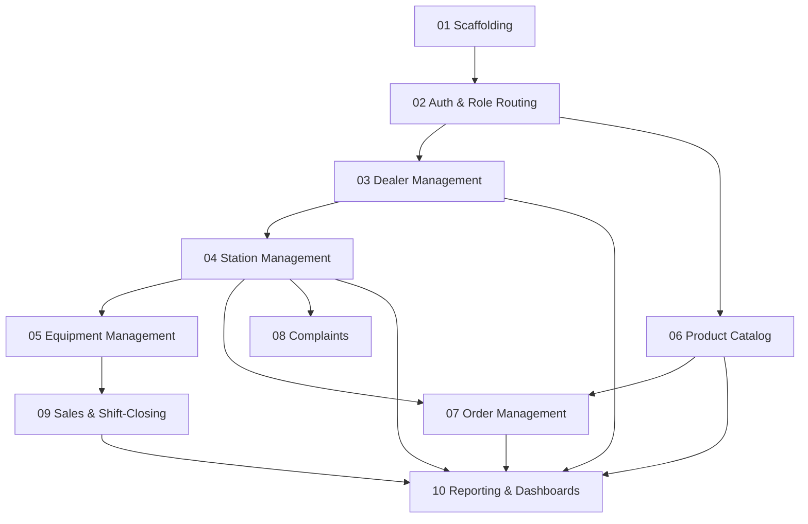

# Plan Overview: Dealer & Fuel Station Management System

**Planning ticket:** [Fuel_Petroleum#2](https://github.com/Nouman810/Fuel_Petroleum/issues/2)
**Full spec:** [spec.md](./spec.md)

A production-quality web app for Ignite Petroleum Limited to manage its dealer network and fuel stations. Admin and Dealer share one login page and are routed to role-specific dashboards. Admin manages dealers, stations, the product catalog, order fulfillment, complaints, and cross-network sales reporting. Dealers manage their own station's equipment, place orders, log complaints, and record daily shift-closing sales and meter readings.

Branding: flame-in-gear logo, primary red `#DC3B2A` / accent orange `#F5A623` / cream background `#FDF9F5` — see [spec.md](./spec.md#branding).

## Task Sequence

| # | Title | What it delivers | Depends on |
|---|-------|-------------------|------------|
| 01 | Project scaffolding | Express + Prisma + PostgreSQL backend skeleton, React frontend skeleton, lint/test/CI | - |
| 02 | Auth & role-based routing | Login, JWT issuance/refresh, role guard, dealer-scoping middleware, single login → role redirect | 01 |
| 03 | Dealer management | Admin CRUD for dealers (onboard, edit, suspend/activate) | 02 |
| 04 | Station management | Admin creates/assigns stations to dealers; Dealer views/edits own station | 03 |
| 05 | Equipment management | Dealer CRUD for tanks, dispensers, nozzles per station | 04 |
| 06 | Product catalog | Admin CRUD for MS/HSD/lubricant products | 02 |
| 07 | Order management | Dealer places MS/HSD + lubricant orders; Admin manages status transitions | 04, 06 |
| 08 | Complaints | Dealer submits complaints; Admin views/resolves | 04 |
| 09 | Sales & shift-closing entry | Dealer records daily shift sales + meter readings per nozzle, with continuity validation | 05 |
| 10 | Reporting & dashboards | Admin dashboards: dealer-wise, station-wise, product-wise, region-wise, lubricant-wise | 03, 04, 06, 07, 09 |

## Dependency Graph

## Parallelism Notes

- **01 → 02** is a strict chain; everything needs auth in place.
- **03 (Dealer mgmt) and 06 (Product catalog)** can run in parallel once 02 is done — neither depends on the other.
- **04 (Station mgmt)** depends only on 03, so it can start as soon as 03 lands, even while 06 is still in progress.
- **05 (Equipment) and 08 (Complaints)** can run in parallel once 04 is done.
- **07 (Orders)** needs both 04 and 06.
- **09 (Sales)** needs 05.
- **10 (Reporting)** is the critical-path tail — it needs 03, 04, 06, 07, and 09 all merged first.

## Migration Notes

Greenfield project, no existing data to migrate. Each task runs its own Prisma migration additively (new tables/columns only) so tasks can merge independently without conflicting schema changes, as long as the dependency order above is respected.
