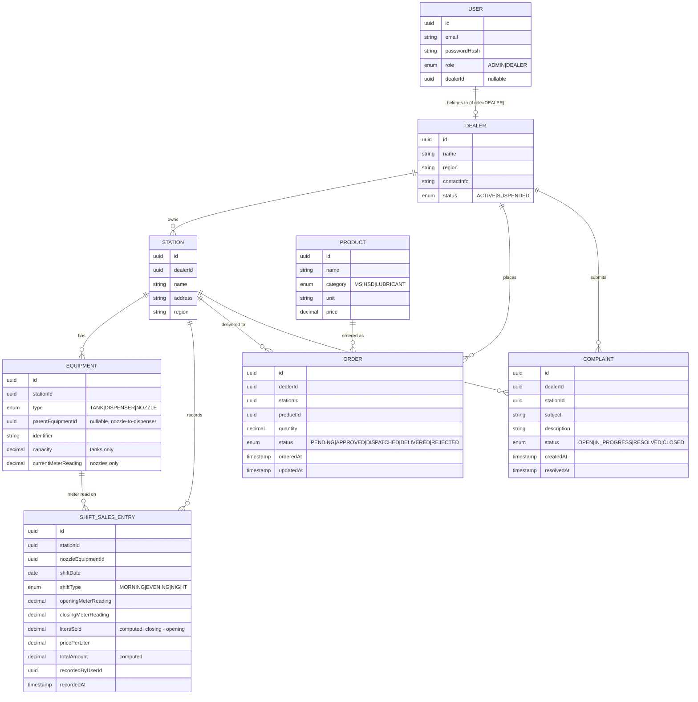
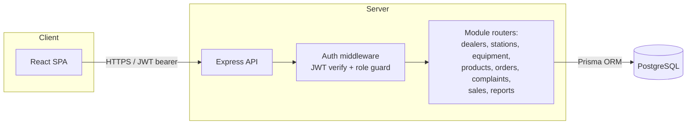

# Dealer & Fuel Station Management System — Spec

**Company:** Ignite Petroleum Limited
**Planning ticket:** [Fuel_Petroleum#2](https://github.com/Nouman810/Fuel_Petroleum/issues/2)
**Status:** Draft (Phase 2)

## Overview

A web-based system for Ignite Petroleum Limited to manage its dealer network and fuel stations. Two roles share one login page and are routed to role-specific dashboards after authentication: **Admin** (the company) and **Dealer** (a person running one or more stations under the company).

Admins manage the dealer network end-to-end: onboarding dealers, assigning stations, maintaining the product catalog, tracking and resolving complaints, managing fuel/lubricant orders, and monitoring sales performance across the whole network. Dealers manage their day-to-day station operations: equipment, orders, complaints, and daily sales recording.

## Branding

Source logo: `E:/Fuel_Petroleum/ignite.jpeg` (flame-in-gear mark, "Ignite Petroleum Limited" wordmark).

| Token | Hex | Use |
|---|---|---|
| `--color-primary` | `#DC3B2A` (flame red) | Primary actions, active nav, Admin accents, links |
| `--color-accent` | `#F5A623` (flame orange) | Secondary accents, highlights, badges, Dealer accents |
| `--color-background` | `#FDF9F5` (cream) | App background |
| `--color-surface` | `#FFFFFF` | Cards, panels, modals |
| `--color-text` | `#231A15` (dark neutral) | Body text — not from the logo, chosen for contrast against cream |

These become CSS custom properties / a theme config in Task 01 (project scaffolding), so every later task's UI pulls from the same tokens instead of hardcoding colors. The logo is used as the app's primary logo (login page, sidebar/header in both Admin and Dealer shells) and as the favicon source.

## Why This System?

Today this is manual (paper logs, phone calls, spreadsheets) or nonexistent. That means:
- No single source of truth for how much fuel/lubricant each station has ordered or received
- No visibility into per-station or per-dealer sales performance until someone manually compiles it
- Complaints get lost or take too long to route to the right person
- Meter readings and shift-closing sales aren't systematically recorded, making reconciliation and fraud detection hard

This system centralizes all of that into one application with clear role separation.

## Roles & Access

- **Single login page.** On successful authentication, the server returns a JWT carrying the user's role (`ADMIN` or `DEALER`). The frontend reads the role claim and routes to `/admin` or `/dealer`.
- **Admin** has no station of their own — it operates over the whole network.
- **Dealer** is scoped to the station(s) assigned to them. All dealer-side reads/writes are restricted to their own stations at the API layer (not just hidden in the UI).

## Data Model (high level)

Region lives on both `Dealer` and `Station` (a dealer's stations are normally in one region, but the field is kept on `Station` too since reporting is region-wise and a dealer could span regions).

## Architecture

Single deployable API + single SPA. No microservices — nothing here needs independent scaling, and a modular monolith is far cheaper to build and operate for one team.

## Component Design

**Auth module**
- `POST /auth/login` — validates credentials (bcrypt), issues access token (short-lived) + refresh token (long-lived, httpOnly cookie or rotated on use)
- `POST /auth/refresh` — rotates access token
- Role guard middleware rejects requests where the JWT role doesn't match the route's required role(s)
- Dealer-scoping middleware: for any Dealer-role request touching a station/order/complaint/sales resource, verify the resource belongs to that dealer before proceeding

**Dealer management (Admin only)**
- CRUD dealers, set status (active/suspended), view a dealer's stations and order history

**Station management**
- Admin: create stations, assign to a dealer, edit, view all
- Dealer: view/edit their own station's profile (address, contact) — cannot reassign ownership or create new stations

**Equipment management (Dealer, scoped to own stations)**
- CRUD tanks, dispensers, nozzles per station
- Nozzles reference a parent dispenser; track current meter reading (updated by shift-sales entries)

**Product catalog (Admin only)**
- CRUD products: MS, HSD, lubricant SKUs, each with unit and price

**Order management**
- Dealer: place an order (product + quantity) against one of their stations
- Admin: view all orders, transition status (PENDING → APPROVED → DISPATCHED → DELIVERED, or REJECTED at any pre-delivery stage)
- Status transitions are validated server-side (no skipping stages, no editing a DELIVERED order)

**Complaints**
- Dealer: submit a complaint tied to a station, view their own complaints' status
- Admin: view all complaints, update status, resolve

**Sales & shift-closing entry (Dealer, scoped to own stations)**
- Record one entry per nozzle per shift: opening/closing meter reading, computed liters sold and total amount
- Validation: closing reading must be ≥ opening reading; opening reading for a shift must equal the prior shift's closing reading for that nozzle (continuity check)
- On save, updates the nozzle's `currentMeterReading`

**Reporting & dashboards (Admin)**
- Aggregate sales by dealer, by station, by product, by region, and by lubricant specifically
- Backed by SQL aggregation queries (grouped sums over `ShiftSalesEntry` joined to `Station`/`Dealer`/`Product`), not a separate analytics store — volume doesn't justify one yet

## Error Handling

- `400` — validation failure (schema-validated request bodies, e.g. zod)
- `401` — missing/invalid/expired JWT
- `403` — valid JWT but wrong role, or a Dealer touching a resource outside their own stations
- `404` — resource not found
- `409` — business-rule conflict (e.g. meter-reading continuity check fails, duplicate product name, order status transition not allowed)
- All mutating endpoints that touch more than one table (e.g. shift-sales entry updating both the entry and the nozzle's meter reading) run inside a DB transaction so a partial failure can't leave inconsistent state.

## Reliability / Degradation

- No audit-log system for MVP (confirmed acceptable) — but every mutable record keeps `createdAt`/`updatedAt` and a `recordedByUserId`/`updatedByUserId` where relevant, so "simple CRUD" doesn't mean "untraceable."
- Rate-limit the login endpoint to blunt credential-stuffing attempts.
- Dealer-scoping is enforced at the API layer, not just hidden in the UI — a Dealer's JWT alone must never be sufficient to read or write another dealer's data.

## Monitoring

- Structured request logging (method, path, status, latency, user id/role)
- `/health` endpoint checking DB connectivity, for whatever deployment target gets chosen later
- Error responses logged with enough context to reproduce (route, validation errors, user id) but never with passwords or tokens

## Migration / Rollout Plan

Greenfield project — no data migration. Rollout is straightforward:
1. Build and merge each module (see raw prompts) against the story branch
2. Run Prisma migrations against a fresh Postgres instance per environment (dev → staging → prod, whenever infra is chosen)
3. Seed one initial Admin user via a one-off script (no self-registration — dealers are created by Admin, not signed up)
4. Smoke-test login → role redirect → one CRUD flow per module before considering an environment live

## Implementation Checklist

- [ ] Project scaffolding: Express + Prisma + Postgres backend, React frontend, shared tooling (lint/test/CI)
- [ ] Auth: login, JWT issuance/refresh, role guard, dealer-scoping middleware
- [ ] Dealer management (Admin)
- [ ] Station management (Admin create/assign, Dealer view/edit own)
- [ ] Equipment management (Dealer: tanks, dispensers, nozzles)
- [ ] Product catalog (Admin: MS/HSD/lubricants)
- [ ] Order management (Dealer place, Admin approve/dispatch/deliver/reject)
- [ ] Complaints (Dealer submit, Admin resolve)
- [ ] Sales & shift-closing entry (Dealer, with meter-reading continuity validation)
- [ ] Reporting & dashboards (Admin: dealer/station/product/region/lubricant-wise)
